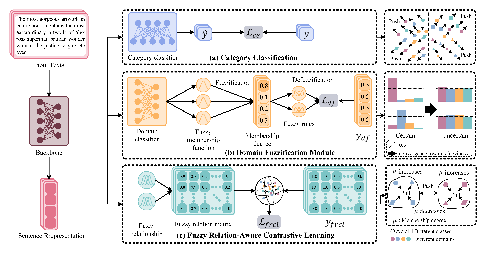
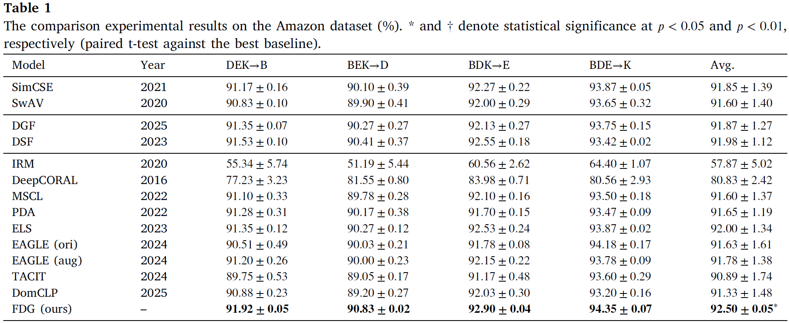
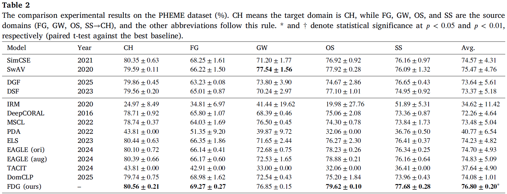
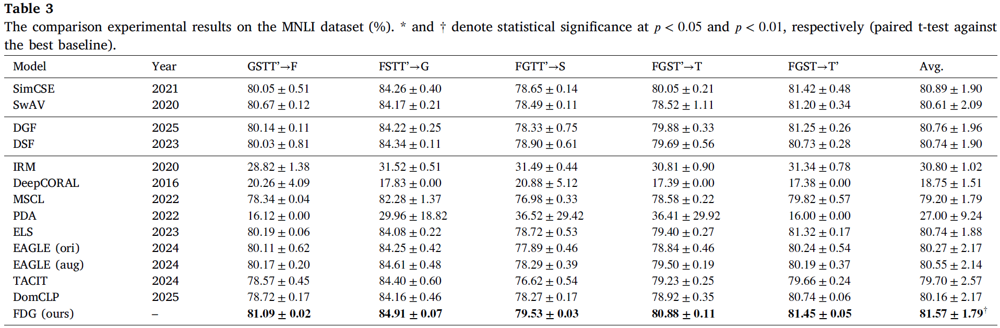
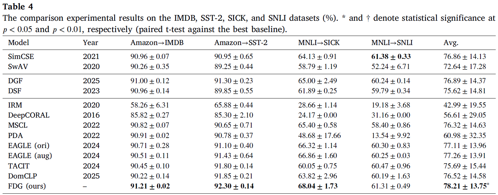

# Text Domain Generalization via Domain Fuzzification and Fuzzy Relation-Aware Contrastive Learning
Official PyTorch implementation of **Fuzzy Domain Generalization (FDG)**, introduced in:

> **Text Domain Generalization via Domain Fuzzification and Fuzzy Relation-Aware Contrastive Learning**  
Qizhi Li, Baiyang Chen, Yingke Chen, Zhong Yuan, Dezhong Peng, Qilin Li, and Xu Wang  
*Pattern Recognition*, Volume 180, Article 114327, 2026.

## Introduction

Domain generalization aims to train a model on multiple source domains that can generalize to an unseen target domain. In natural language processing, however, domain boundaries are often ambiguous and overlapping. Existing methods usually assume deterministic domain assignments and commonly rely on adversarial training or extensive data augmentation, which may introduce unstable optimization and substantial computational overhead.

To address these challenges, we propose **Fuzzy Domain Generalization (FDG)**, a lightweight framework that explicitly models domain uncertainty using fuzzy logic. FDG contains two complementary modules:
1. **Domain Fuzzification (DF):** assigns fuzzy domain memberships to each sample and encourages the model to learn domain-invariant representations without adversarial min-max optimization.
2. **Fuzzy Relation-Aware Contrastive Learning (FRCL):** constructs a fuzzy relation matrix to capture continuous semantic relationships between samples without additional data augmentation.

FDG consistently outperforms 13 strong baselines across seven benchmark datasets. It improves Macro-F1 by up to **0.87 percentage points**, reduces runtime by more than **67.51%**, and introduces only **0.0008M** additional parameters when the number of source domains increases from three to four.

## Requirements

The experiments were conducted on one NVIDIA RTX 3090 Ti GPU using RoBERTa-base as the default backbone.

- Python 3.10+
- PyTorch 2.6.0
- Transformers 4.57.3
- NumPy
- scikit-learn
- tqdm
- RoBERTa-base: https://huggingface.co/FacebookAI/roberta-base
- DistilRoBERTa-base: https://huggingface.co/distilbert/distilroberta-base
- RoBERTa-large: https://huggingface.co/FacebookAI/roberta-large

## Framework

FDG consists of four components:

1. **Text encoder:** encodes input texts into sentence representations. All Transformer layers are fine-tuned.
2. **Category classifier:** learns task-discriminative features using category-aware cross-entropy supervision.
3. **Domain Fuzzification module:** converts domain logits into fuzzy membership degrees and reduces domain-specific separability.
4. **Fuzzy Relation-Aware Contrastive Learning module:** models pairwise semantic relationships through a fuzzy relation matrix and preserves category-level structure across domains.



## Experimental Results

- Experimental results on the Amazon dataset:



- Experimental results on the PHEME dataset:



- Experimental results on the MNLI dataset:



- Experimental results on the cross datasets:



# Running GenPromptCL

Just execute the following code in the terminal:

```
python run/run_model_cls_head.py --target_domain book --seed 9 --cuda 0 --scl --model roberta-base
```

## Citation
If you find this work useful, please cite:
```bibtex
@article{li2026fdg,
  author       = {Qizhi Li and
                  Baiyang Chen and
                  Yingke Chen and
                  Zhong Yuan and
                  Dezhong Peng and
                  Qilin Li and
                  Xu Wang},
  title        = {Text domain generalization via domain fuzzification and fuzzy relation-aware
                  contrastive learning},
  journal      = {Pattern Recognition},
  volume       = {180},
  pages        = {114327},
  year         = {2026},
  doi          = {10.1016/J.PATCOG.2026.114327}
}
```
